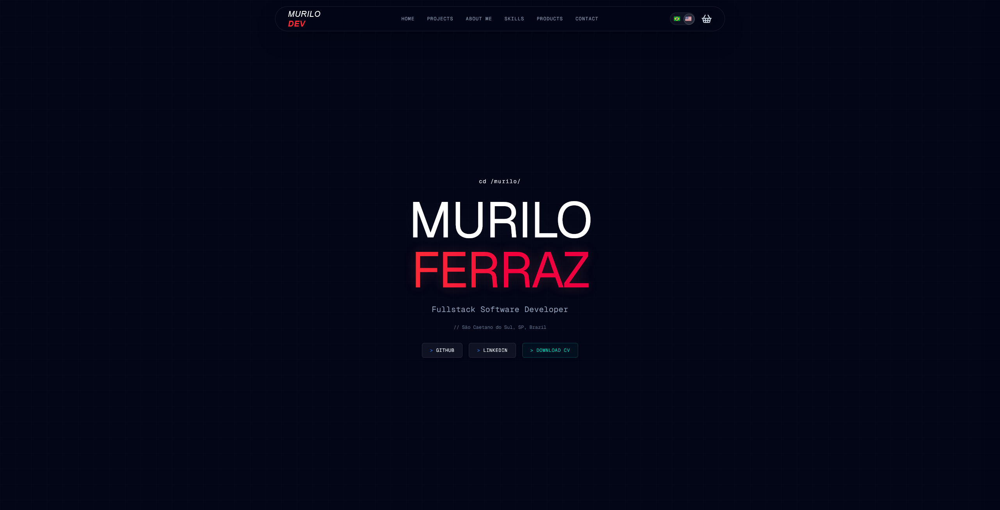
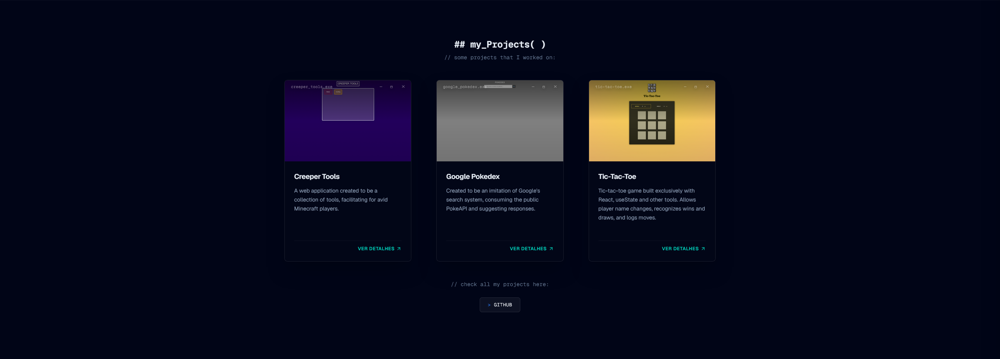

# Murilo Ferraz — Portfolio

Personal portfolio site built with Next.js, React, and TypeScript. It showcases my projects, background, tech stack, and includes a small interactive "store" where visitors can grab my CV.

**Live site:** [murilosouzadev.vercel.app](https://murilosouzadev.vercel.app/)

## Screenshots

> Drop your screenshot files into a `docs/screenshots/` folder at the root of the repo, then reference them below with relative paths, e.g. ``.





## Tech Stack

- **Framework:** Next.js (App Router)
- **Language:** TypeScript
- **UI:** React, Tailwind CSS, Radix UI, Lucide Icons
- **State management:** React Context + `useReducer` (cart) and Context + `useState` (language)
- **Form handling:** Formspree
- **Spam protection:** Cloudflare Turnstile
- **Deployment:** Vercel

## Features

### Multi-section layout

The page is organized into self-contained sections, each its own component: Home, Projects, About Me, Skills, Products, and Contact. A fixed header provides smooth-scroll navigation between them.

### Language toggle (EN / PT-BR)

All page content — section headings, project and skill descriptions, form labels, and UI copy — is fully translated between English and Portuguese. A toggle in the header switches the active language instantly via a shared React Context, with no page reload.

### Shopping cart system

The Products section features a small "store" where visitors can add my CV (available in both English and Portuguese) to a cart. The cart is built with React Context and a `useReducer`-based state machine, supporting:

- Adding items, increasing/decreasing quantity (capped between 0 and 99)
- Removing individual items or clearing the cart
- A sliding sidebar cart with a live item counter on the header icon
- A "Buy now" action that triggers a download of the selected CV file(s) — no payment processing involved, it's a playful nod to e-commerce UX

### Contact form with spam protection

The Contact section is a fully validated form (required fields, email format checking) with loading, success, and error states.

Submissions are handled by **Formspree**, a third-party form backend that forwards messages to my email without needing a custom server. To prevent automated spam submissions from exhausting the form's monthly quota or flooding my inbox, the form integrates **Cloudflare Turnstile** — a privacy-friendly CAPTCHA alternative that runs an invisible challenge in the background and only blocks submissions that fail verification. Formspree validates the Turnstile token server-side before accepting any submission.

## Getting Started

Clone the repository and install dependencies:

```bash
git clone https://github.com/mfsouza95/my_portfolio.git
cd my_portfolio
pnpm install
```

Run the development server:

```bash
pnpm dev
```

Open [http://localhost:3000](http://localhost:3000) to view it in the browser.

No environment variables are required to run the project locally. The Formspree endpoint and Cloudflare Turnstile site key are configured directly in `src/app/components/Contact.tsx`.

## License

This project is licensed under the MIT License — see the [LICENSE](./LICENSE) file for details.